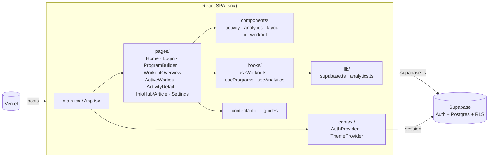

# Workout Web

A mobile-first React workout tracking web app. Log sets with RIR, follow programs, view analytics, and customize your theme.


## Architecture



More detail: [docs/ARCHITECTURE.md](docs/ARCHITECTURE.md)

## Stack

- **React + Vite + TypeScript** — frontend SPA
- **Supabase** — auth, database, Row Level Security
- **Vercel** — deployment
- **Tailwind CSS** — styling with customizable accent and light/dark mode

## Features

- **Home** — yearly activity grid, next workout preview, start empty workout
- **Workout** — program builder, analytics (volume, 1RM, intensity map, stress indices)
- **Live workout** — set logging, colored RIR input, rest timer
- **Info** — workout, movements, anatomy, and training guides
- **Settings** — accent color, light/dark theme, body weight tracking

## Setup

1. **Install dependencies**
   ```bash
   npm install
   ```

2. **Configure environment variables**

   See **[docs/ENVIRONMENT.md](docs/ENVIRONMENT.md)** for the full guide on API keys and which files need changes.

   ```bash
   cp .env.example .env.local
   ```

   Fill in `VITE_SUPABASE_URL` and `VITE_SUPABASE_ANON_KEY` from your Supabase project.

3. **Run database migration**

   Paste [`supabase/migrations/001_initial_schema.sql`](supabase/migrations/001_initial_schema.sql) into the Supabase SQL Editor and run it.

4. **Start dev server**
   ```bash
   npm run dev
   ```

## Deploy to Vercel

1. Push to GitHub (`.env.local` stays out of the repo).
2. Import the repo in Vercel (Vite preset).
3. Add `VITE_SUPABASE_URL` and `VITE_SUPABASE_ANON_KEY` in Vercel environment variables.
4. Add your Vercel URL to Supabase Auth redirect URLs.

## Project Structure

```
src/
├── components/     UI, layout, activity, workout, analytics
├── content/info/   Educational articles
├── context/        Auth and theme providers
├── hooks/          Supabase data hooks
├── lib/            Supabase client and analytics
├── pages/          Route pages
└── styles/         Theme CSS variables
```

## Security

Only the Supabase **anon key** belongs in client env vars. The **service role key** must never be added to this project. RLS policies protect all user data.
