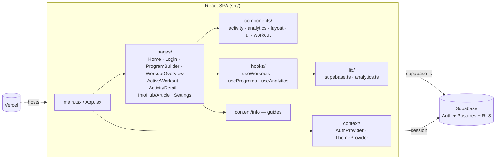

# Architecture

A mobile-first React + Vite + TypeScript SPA backed by Supabase (auth, Postgres with RLS), deployed on Vercel.

```mermaid
flowchart LR
    subgraph SPA["React SPA (src/)"]
        Main[main.tsx / App.tsx] --> Ctx["context/<br/>AuthProvider · ThemeProvider"]
        Main --> Pages["pages/<br/>Home · Login · ProgramBuilder · WorkoutOverview<br/>ActiveWorkout · ActivityDetail · InfoHub/Article · Settings"]
        Pages --> Comps["components/<br/>activity · analytics · layout · ui · workout"]
        Pages --> Hooks["hooks/<br/>useWorkouts · usePrograms · useAnalytics"]
        Hooks --> Lib["lib/<br/>supabase.ts · analytics.ts"]
        Pages --> Content[content/info — guides]
    end

    Lib -->|supabase-js| SB[(Supabase<br/>Auth + Postgres + RLS)]
    Ctx -->|session| SB
    Vercel[(Vercel)] -.hosts.-> SPA
```

Environment variables are documented in `docs/ENVIRONMENT.md`.
